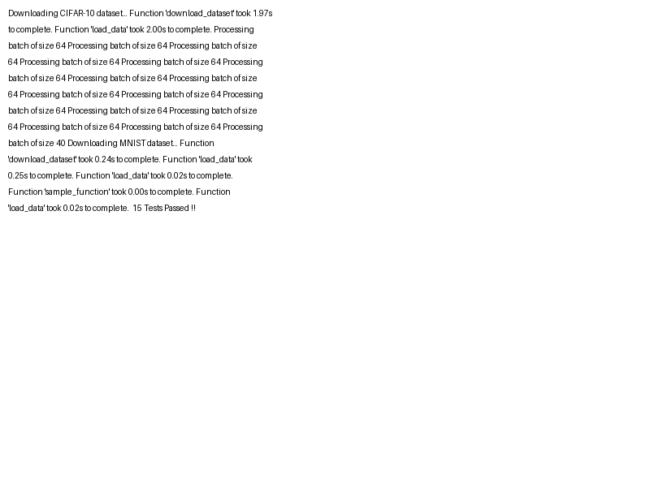

# DataLoader Package


## Overview

The **DataLoader** package is a flexible and efficient data loading solution designed for various AI and machine learning projects. It supports loading, preprocessing, and managing different types of datasets, including:

- Image datasets (e.g., MNIST, CIFAR-10, CIFAR-100)
- Text datasets (e.g., CSV, JSON)
- Structured data (e.g., CSV files)
- Unstructured data (e.g., folders containing multiple file formats like text, images, etc.)
- Text images and other formats

The DataLoader can also load data directly from URLs, allowing for seamless integration of online datasets into your projects.

## Features

- **Download Datasets**: Automatically downloads datasets from online sources if they are not already present locally.
- **Handle Different Formats**: Supports a variety of file formats, including CSV, JSON, image formats (JPEG, PNG), and text files.
- **Batch Processing**: Provides data in batches for efficient processing, making it suitable for large datasets.
- **Data Augmentation and Preprocessing**: Supports data augmentation and preprocessing steps to enhance data quality.
- **Extensible Design**: Easily extensible to accommodate new data types and sources.
- **Python Concepts**: Implements various Python concepts such as decorators, context managers, and generators to improve code structure and readability.

## Installation

To install the DataLoader package, follow these steps:

1. Clone the repository:
   ```bash
   git clone https://github.com/yourusername/dataloader-package.git
   cd dataloader-package
   ```

2. Install the required dependencies:
   ```bash
   pip install -r requirements.txt
   ```

## Usage

### Basic Usage

Here’s a simple example demonstrating how to use the DataLoader to load an image dataset from a URL:

```python
from dataloader import DataLoader

# Create a DataLoader instance
data_loader = DataLoader()

# Load an image dataset from a URL
image_dataset = data_loader.load_data(url='https://example.com/dataset.zip')

# Process the dataset
for batch in data_loader.get_batches(image_dataset, batch_size=32):
    # Perform operations on each batch
    print(batch)
```

### Loading Data from a URL

The DataLoader allows you to easily load data from a URL. You can specify the URL of the dataset as follows:

```python
data_loader = DataLoader()
dataset = data_loader.load_data(url='https://example.com/dataset.zip')
```

This will download the dataset from the specified URL and prepare it for further processing.

### Example: Loading a CSV File

You can also load structured data, like CSV files, from a local path or URL:

```python
# Load data from a local CSV file
csv_data = data_loader.load_data(file_path='data/my_data.csv')

# Load data from a CSV file available at a URL
csv_data_from_url = data_loader.load_data(url='https://example.com/my_data.csv')
```

### Batch Processing

The DataLoader provides a method to retrieve data in batches:

```python
for batch in data_loader.get_batches(csv_data, batch_size=10):
    # Process each batch of data
    print(batch)
```

### Data Augmentation

If you're working with image datasets, the DataLoader can also apply data augmentation techniques:

```python
augmented_data = data_loader.apply_augmentation(image_dataset)

for augmented_batch in data_loader.get_batches(augmented_data, batch_size=16):
    # Use the augmented batch for training
    print(augmented_batch)
```

### Function Descriptions

1. **`load_data(url=None, file_path=None)`**:
   - Loads data from a specified URL or a local file path.
   - **Parameters**:
     - `url` (str): The URL of the dataset to download.
     - `file_path` (str): The local path of the dataset file.
   - **Returns**: The loaded dataset.

   **Example**:
   ```python
   data_loader = DataLoader()
   dataset = data_loader.load_data(url='https://example.com/data.csv')
   ```

2. **`get_batches(data, batch_size)`**:
   - Generates batches of data for processing.
   - **Parameters**:
     - `data`: The dataset to be divided into batches.
     - `batch_size` (int): The number of samples per batch.
   - **Returns**: A generator that yields batches of data.

   **Example**:
   ```python
   for batch in data_loader.get_batches(dataset, batch_size=32):
       print(batch)
   ```

3. **`apply_augmentation(data)`**:
   - Applies data augmentation techniques to the given dataset, especially for image data.
   - **Parameters**:
     - `data`: The dataset to which augmentation will be applied.
   - **Returns**: The augmented dataset.

   **Example**:
   ```python
   augmented_data = data_loader.apply_augmentation(image_dataset)
   ```

4. **`preprocess_data(data)`**:
   - Preprocesses the loaded data by applying necessary transformations.
   - **Parameters**:
     - `data`: The dataset to preprocess.
   - **Returns**: The preprocessed dataset.

   **Example**:
   ```python
   preprocessed_data = data_loader.preprocess_data(csv_data)
   ```

5. **`save_data(data, file_path)`**:
   - Saves the processed data to a specified local file path.
   - **Parameters**:
     - `data`: The data to save.
     - `file_path` (str): The destination path for saving the file.
   - **Returns**: None.

   **Example**:
   ```python
   data_loader.save_data(preprocessed_data, file_path='data/processed_data.csv')
   ```

## Conclusion

The DataLoader package provides a comprehensive solution for loading and managing various types of datasets, making it an essential tool for AI and machine learning practitioners. By leveraging its features, you can streamline your data handling processes, enabling you to focus on building effective models.


### Summary of Changes:
- Added detailed function descriptions for key methods in the DataLoader package.
- Included additional example usage for each function to illustrate their applications and parameters.

Feel free to further adjust or let me know if you want additional changes!
=======
If you're using GitHub Actions for CI/CD, you can check the status of the tests with the badge included at the top of this README.

## Test Results



## Test Results


## Test Results


